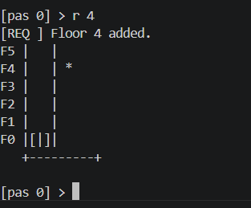
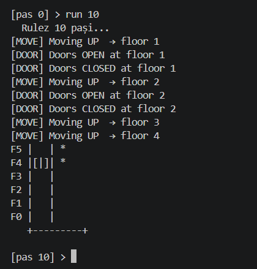
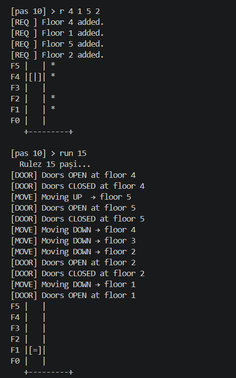

 Elevator Simulator (C++)


A console-based elevator simulation built in C++ using Object-Oriented Programming and a SCAN scheduling algorithm.


 Features


- Multi-floor elevator system (0–5 floors)

- SCAN scheduling algorithm for movement optimization

- Step-based simulation (like real-time system)

- Multiple requests handling (e.g. `r 2 5 1`)

- Door open/close simulation with timer

- Interactive command-line interface


---


 Commands


- `Enter` → execute one simulation step

- `r <floors>` → add requests (example: `r 3` or `r 2 5 1`)

- `run <n>` → run n simulation steps automatically

- `help` → show available commands

- `q` → quit program


---


 How to run


Compile:

```bash

g++ main.cpp elevator.cpp -o elevator


RUN:

.\\elevator.exe (Windows)

./elevator (Linux/Mac)


Algorithm


This project uses a simplified SCAN (elevator) scheduling algorithm:


The elevator moves in one direction serving requests

When no more requests exist in that direction, it changes direction


Author: Student ETTI-CTI BUCHAREST


## Demo


### Start




### Requests




### Run simulation



